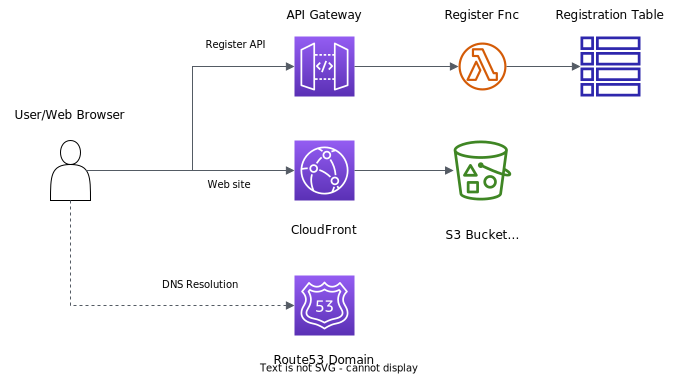

# Cloud Logic Implementation on AWS

This project is part of an assessment task for a university course. I have made it public here to share with the staff and so that other students can see how the site was created if they are interested.

Aside from (hopefully) completing the requirements for the assessment, it demonstrates the use of CDK and the Parcel bundler to deploy a static web site to AWS. As always with the work I share - be aware I am not a front-end developer and you probably won't learn too much from the web site itself!

The CDK project, Lambda function and web scripts are all built in TypeScript.

The core element of this assignment is the development and deployment of a cloud-based static website using AWS serverless architecture. The site includes a registration form to sign up for a special event, and forms and methods to check and modify your registration.

Shortcuts to the key components:
- [Lambda function](./src/lambda/register/index.ts)
- [Web site](./src/web)

This repo will be public for a short time only so make a copy if you find it useful.

&nbsp;

## Site Architecture

&nbsp;

## Deployment

You can easily deploy the site yourself if keen.

**Note the local build scripts use Bash. On Windows you will need to use GitBash or WSL or similar to build the project.**

Requirements:

- Install nodejs. The project is built using [v16](https://nodejs.org/en/blog/release/v16.20.0) but should also work with v18.
- Install and configure [AWS CDK](https://docs.aws.amazon.com/cdk/v2/guide/getting_started.html) and the [AWS CLI](https://docs.aws.amazon.com/cli/latest/userguide/getting-started-install.html) locally
- CDK Bootstrap your AWS environment (covered in the AWS CDK link above)
- From the root of the project: `npm ci` and then `npm run build`
- By default the site will deploy without a custom domain. The CloudFront and API Gateway endpoints will be used for the web site and API respectively. If you have your own domain in Route53 skip to Customising the Deployment.
- To deploy with the default endpoints to your default environment: `cdk deploy`

The endpoint URL's will be output in the CLI and in CloudFormation in the console. As the API Gateway endpoint is dynamically generated the web site will not know where to find it, so there's an extra step required to complete the setup.

To complete the setup:
- Get the API URL from the deployment output
- Update the URL's in `src/web/.env`
- From the `src/web` folder run `npm run build`
- Run `cdk deploy`

The site and register API should now work.

&nbsp;

## Customising the Deployment

There are two places you can customise the deployment:
- The web site can be customised by updating variables in `src/web/.env`
- The application can be customised by updating the configuration file at `config/local.ts` (this file is created from `config/template.ts` in the build step).

&nbsp;

## Using a Custom Domain

You can use a custom domain if you have one in your AWS account. The domain must be hosted in Route53 in the account you are deploying to.

To use your own domain add the `zoneProps` fields in `config/local.ts`.

There is one extra requirement to using a custom domain on CloudFront for the web site - creating or importing a Certificate.

CloudFront requires that the certificate for the web site is created in the `us-east-1` region. While it is possible to create a certificate using CDK in a different region to your deployment it is beyond the scope of this project. So you have two options here:
- Create the certificate yourself in `us-east-1` and import it here. The certificate should be a wildcard like `*.mydomain.com`.
- Deploy the application in `us-east-1`. In that case the deployment will create the certificate for you (recommended).

Then to deploy:
- Update the API URL in `src/web/.env` (by default this will be `api.mydomain.com` but you can modify that in `config/local.ts`)
- Run `cdk deploy`

&nbsp;

## Running the Web Site Locally

The web site is bundled using Parcel. To run it locally for testing and development:
- From the `src/web` folder: `npm run start`
- The web site will start at `http://localhost:1234`
- The API is configured to allow localhost in CORS so everything should work

&nbsp;

## CDK Project Notes

The project uses a custom CDK construct for the API Gateway in `lib/constructs/custom-api`. This removes a lot of code from the main stack module and creates a construct that can be easily re-used in other projects.

The API construct and application stack demonstrate how to create a REST API with a CORS configuration that supports POST and other CORS unsafe methods.

The Lambda function uses [Lambda PowerTools](https://awslabs.github.io/aws-lambda-powertools-typescript/latest/) for logging and metrics.

For more information on both PowerTools and custom constructs you can check out my PowerTools demo project [here](https://github.com/markilott/aws-cdk-lambda-powertools).

&nbsp;

## Testing the API

I'm not documenting the API methods here as they are not really the point of the project.

In a nutshell though there is a single `register` endpoint with the following methods:
- `POST`: create a new registration
- `GET`: get an existing registration by reference or email
- `PATCH`: update an existing registration (request a new date)
- `DELETE`: cancel an existing registration

A Postman collection is included for testing the API if required:
- Import the API collection into Postman from [here](./postman/api.postman_collection.json)
- Update the Collection variable `baseUrl` to your own API endpoint URL. No other variables need to be updated.
- Run individual requests or use the Collection runner to test all of them in sequence

&nbsp;

## Costs and Cleanup

The resources created are well within the AWS free tier and there is no cost to the deployment or application. It does create a public web site and API by default however so you should clean it up when done to avoid any nasty surprises.

(Note that it is possible to add your own IP address to an allow list so only you can access the API. See `allowCidrs` in the config file. By default there is also a very low rate limit configured on the API to reduce the chance of abuse.)

When you are done simply run `cdk destroy` to delete the whole application and site.
